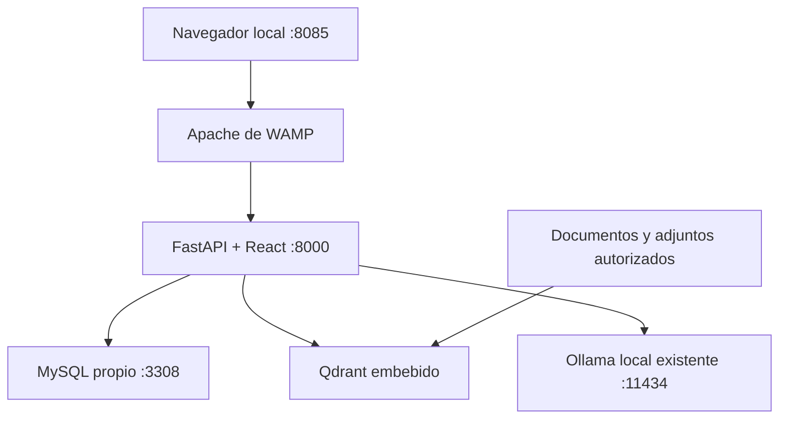

# Matrix RH 1.4.2

<!-- Creado por Aldo Garcia. -->

Asistente documental de Recursos Humanos con FastAPI/Python, React/TypeScript, MySQL, Qdrant y modelos locales mediante Ollama. Consulta documentos autorizados, resume secciones, compara fuentes y analiza adjuntos privados de la conversación. Conserva cuentas, permisos, conversaciones e índices en esta instalación.

La instalación principal es **Windows x64 con WampServer**, dentro de `C:\wamp64\www\matrix-rh-1.4.2`. Apache de WAMP publica la aplicación; Python sirve la API y la interfaz compilada. No se usa PHP ni la base de datos compartida de WAMP. Docker es una alternativa separada para Linux.

## Arquitectura y alcance



Los documentos, índices, SQL, secretos y runtimes propios de Matrix permanecen dentro de su carpeta. **Se reutilizan el Ollama y los modelos ya instalados por el usuario**, en su ubicación actual: no se copian, descargan, actualizan ni eliminan. Windows, WAMP y Ollama local activo son prerrequisitos. El instalador agrega un include al Apache existente y valida su configuración antes de reiniciarlo; ese reinicio interrumpe brevemente los demás sitios de WAMP. `detener.bat` deja Apache disponible.

El perfil predeterminado `standalone` es para uso en este equipo: Apache, API y MySQL propios escuchan en loopback y Matrix accede a Ollama por loopback. La escucha del servicio Ollama sigue regida por su configuración existente. La identidad local es real y persistente, con contraseñas protegidas con hash Argon2id, sesiones, CSRF, permisos y bloqueo por intentos; las cuentas de prueba están desactivadas. Para uso por otros equipos se requiere diseñar y validar HTTPS, firewall, identidad y protección de datos. No habilite acceso LAN cambiando solamente `APP_HOST`.

## Estructura

```text
matrix-rh-1.4.2/
├── knowledge-base/
│   ├── documents/prestaciones/     # 6 PDF originales, sin alteraciones
│   ├── unclassified/ACR/          # 10 documentos conservados, sin indexar
│   ├── state/                     # MySQL, Qdrant, adjuntos y control de procesos
│   └── backups/                   # respaldos completos, creados al respaldar
├── backend/
│   ├── app/                       # API, identidad, extracción, RAG y modelo
│   ├── config/                    # plantilla, configuración privada y políticas
│   ├── scripts/windows/           # controlador de los cuatro BAT
│   ├── scripts/                   # diagnóstico y mantenimiento
│   ├── migrations/                # esquema SQL versionado
│   ├── seeds/                     # políticas; fixtures de usuarios desactivados
│   ├── tests/                     # pruebas y conocimiento sintético aislado
│   ├── release/                   # integridad, procedencia y mapa de movimientos
│   ├── runtime/                   # Python, uv y MySQL propios
│   ├── logs/                      # registros locales
│   ├── Dockerfile
│   ├── pyproject.toml
│   └── uv.lock
├── frontend/                      # React/TypeScript, dist y configuración Nginx
├── instalar.bat
├── iniciar.bat
├── detener.bat
├── diagnosticar.bat
├── docker-compose.yml
├── .htaccess
└── README.md
```

Sólo hay tres carpetas en la raíz. Las carpetas de estado se crean cuando se necesitan. `.htaccess` se conserva expresamente: impide publicar código, bases y secretos desde el DocumentRoot de WAMP. La configuración Apache generada también deniega acceso directo al árbol del proyecto. No lo quite para intentar abrir la interfaz: use el puerto 8085.

### Qué se movió o retiró

| Antes | Ahora / motivo |
|---|---|
| `data/prestaciones` y PDF de gastos médicos | `knowledge-base/documents/prestaciones`; mismos bytes y categoría |
| `data/ACR` | `knowledge-base/unclassified/ACR`; conservar sin inventar clasificación ni permisos |
| Corpus sintético | `backend/tests/fixtures/knowledge`; excluido de la ingesta operativa |
| `config`, `.env.example`, SQL y Nginx de infraestructura | `backend/config`, `backend/docker` y `frontend/nginx` |
| Scripts Windows y numerosos BAT | Un controlador interno y cuatro BAT relativos |
| `docs`, README adicionales y guías históricas | Este README; sin documentación duplicada |
| Traslados automáticos entre entregas y limpieza legacy | Retirados; podían mezclar SQL, índices y adjuntos de instalaciones distintas |
| Dependencias instaladas, cachés y `reports` | No forman parte del ZIP limpio |

El mapa por archivo y los hashes de procedencia están en `backend/release/layout-migration.json`. La entrega anterior no se modifica. Este ZIP contiene el código y los documentos originales incluidos en la entrega base; **no contiene las conversaciones, usuarios ni adjuntos guardados únicamente en su computadora**.

## Requisitos e instalación Windows/WAMP

Necesita Windows x64, PowerShell 5.1 x64 o posterior, WampServer con **Apache 2.4** registrado como servicio. No necesita instalar MySQL como complemento de WAMP: Matrix aprovisiona su propio **MySQL Community 8.4.11 x64**. Los redistribuibles de sistema Visual C++ requeridos por WAMP y MySQL (2019 o 2015–2022 compatible, x64) deben estar operativos; se verifica que ambos ejecutables MySQL puedan iniciar con `--version` antes de crear datos. El instalador comprueba plataforma, privilegios, ubicación, ejecutables, puertos e integridad antes de inicializar la base.

La primera instalación requiere Internet a los proveedores oficiales: GitHub/activos de versiones para Python/uv, PyPI para paquetes y `cdn.mysql.com` para MySQL. **No descarga Ollama ni modelos.** uv, Python y MySQL tienen versiones y SHA256 fijados en `backend/config/runtime-manifest.json`; Python se verifica mediante el registro de descargas del uv fijado. La versión de Ollama existente se conserva y se comprueba su compatibilidad mediante inventario, generación y embeddings. Las dependencias Python quedan fijadas en `uv.lock` y las del frontend en `package-lock.json`.

Para instalaciones nuevas se descarga el ZIP oficial de MySQL (aproximadamente 281 MB), se comprueba su SHA256 y el de `mysqld.exe`/`mysqladmin.exe`, se extrae en una carpeta temporal y se publica en `backend/runtime/mysql` sólo si las validaciones pasan. Se conservan las licencias del fabricante. Matrix crea su datadir y usuarios propios en el puerto 3308; no lee ni modifica las bases de WAMP. El ZIP fijado se verificó con la firma GPG oficial durante la preparación de esta entrega; en el equipo destino se verifican los hashes fijados, sin necesitar GnuPG. No necesita Python, Node, Docker ni una base externa instalados previamente. Sí necesita su Ollama local activo con `gemma4:latest` y `embeddinggemma:latest` ya disponibles.

Reserve espacio para los runtimes propios, índices y respaldos; el instalador exige al menos 10 GiB libres inicialmente y 5 GiB para operación/reinstalación. No reserva ni duplica los pesos de su Ollama. Estos mínimos no garantizan espacio para cualquier corpus. RAM/VRAM y tiempo de respuesta dependen del modelo instalado y del contexto; el instalador ejecuta pruebas de inferencia y embeddings para detectar incompatibilidad o falta de recursos. No se promete funcionamiento de Gemma en cualquier equipo.

1. Detenga Matrix desde su carpeta actual; conserve esa carpeta y sus respaldos. Extraiga **el ZIP completo en una carpeta nueva**: `C:\wamp64\www\matrix-rh-1.4.2`. No superponga archivos sobre otra versión.
2. Inicie WampServer y su aplicación Ollama. Confirme que Apache funciona y que `ollama list` muestra `gemma4:latest` y `embeddinggemma:latest`.
3. Clic derecho en `instalar.bat` → **Ejecutar como administrador**. Use la misma cuenta de Windows y elevación para los cuatro BAT: necesitan consultar la identidad de procesos elevados y operar el servicio Apache. No se elevan silenciosamente.
4. Espere la preparación de MySQL, Python y paquetes. Crea configuración y claves únicas, comprueba su Ollama antes de descargar dependencias propias o inicializar MySQL, verifica los modelos instalados, comprueba coherencia de datos, migra la base, crea el administrador e indexa documentos. Luego espera `/health` y `/ready` y abre `http://127.0.0.1:8085`.
5. Ingrese como `Matrix`. Consulte la clave inicial **sólo localmente** en `backend/config/secrets/local-admin-password.txt` y cámbiela con **Cambiar contraseña** en la interfaz. La clave del archivo deja de ser válida cuando la cambie; el archivo no revela la clave actual.
6. Ejecute `diagnosticar.bat` y las preguntas de aceptación de este README antes de dar acceso a usuarios.

Ollama debe estar abierto con el usuario de Windows que ya dispone de los modelos. Elevar Matrix no cambia el perfil ni la carpeta de modelos del servidor Ollama: Matrix usa su API HTTP, sin ejecutar su CLI como administrador. Los servicios propios de Matrix se ejecutan bajo la cuenta del operador. No se instala una tarea de arranque automático al reiniciar Windows: ejecute `iniciar.bat`.

Repetir `instalar.bat` conserva credenciales, base y revisiones de modelos presentes; no adopta bases ajenas ni sustituye datos incompletos. Un recibo persistente en `backend/config/mysql-initialized.json` impide reinicializar MySQL si se pierde su datadir; `iniciar` nunca inicializa bases. Si faltan secretos o archivos de una instalación con datos, se detiene para que pueda restaurar un respaldo coherente. Una carpeta incompleta de runtime también se conserva para diagnóstico. Una descarga interrumpida no publica un runtime: al repetir se verifica/reutiliza el ZIP válido de `backend/runtime/downloads`. Si ya existe un MySQL propio verificado, se conserva su versión, incluidos runtimes 8.0 de entregas anteriores; no se actualiza automáticamente sobre su datadir. Datos sin su runtime correspondiente requieren restaurar ambos desde un respaldo coherente.

Si MySQL tarda más que el tiempo de espera, el reintento comprueba su identidad y acceso autenticado antes de completar la inicialización y retirar el SQL temporal. El cliente de control usa su archivo de opciones privado y desactiva la lectura de login paths externos. Para el bloqueo de 1.4.1 que exigía MySQL dentro de WAMP, conserve la carpeta anterior y extraiga esta entrega completa en otra carpeta bajo `www`; luego ejecute `instalar.bat` como administrador. No necesita agregar un complemento MySQL a WAMP.

### Comandos y puertos

Ejecute desde una consola como administrador en la carpeta del proyecto, o con clic derecho → Ejecutar como administrador:

| Comando | Función |
|---|---|
| `instalar.bat` | Aprovisionar, verificar, migrar, indexar y arrancar; requiere administrador |
| `iniciar.bat` | Comprobar Ollama existente → MySQL → preflight/API → Apache, salud y navegador |
| `detener.bat` | Parar API y MySQL propios; conservar datos y dejar Ollama/Apache activos |
| `diagnosticar.bat` | Resumen OK/FALLA de configuración, puertos, procesos, espacio, modelos, API, corpus y últimos errores |

| Servicio Windows | Puerto / persistencia |
|---|---|
| Apache WAMP / aplicación | `127.0.0.1:8085`; include propio en `backend/config/apache` |
| API | `127.0.0.1:8000`; interfaz compilada y API desde FastAPI |
| MySQL propio | `127.0.0.1:3308`; `knowledge-base/state/mysql` |
| Ollama existente | `127.0.0.1:11434`; pesos en su ubicación actual, administrados por Ollama |
| Qdrant embebido | Sin puerto; `knowledge-base/state/qdrant`, un solo proceso propietario |
| Adjuntos / registros | `knowledge-base/state/uploads` / `backend/logs` |

Los BAT usan `%~dp0`. Los puertos son configurables en `backend/config/.env` y deben ser distintos. Si cambia el puerto web, repita la instalación para regenerar el include Apache. El puerto de Ollama debe estar ocupado por su servicio existente; se comprueba mediante su API. Matrix no adopta ni detiene ese proceso. Para sus propios servicios comprueba PID, ejecutable e identidad antes de reutilizarlos o detenerlos. Diagnóstico distingue modelos instalados de modelos cargados; un modelo descargado de memoria no equivale a uno perdido.

Fuentes técnicas de MySQL: [ZIP oficial de Windows](https://dev.mysql.com/downloads/mysql/8.4.html?os=3), [instalación y prerrequisitos](https://dev.mysql.com/doc/refman/8.4/en/windows-installation.html) y [verificación de firmas](https://dev.mysql.com/doc/refman/8.4/en/checking-gpg-signature.html).

## Configuración del modelo y RAG

Edite `backend/config/.env` con Matrix detenido. La plantilla `env.example` documenta variables; nunca la copie sobre una configuración existente. Secretos y configuración no se publican por HTTP ni se incluyen en el ZIP.

Configuración Windows generada en `backend/config/.env`:

```dotenv
OLLAMA_BASE_URL=http://127.0.0.1:11434
OLLAMA_FAST_MODEL=gemma4:latest
OLLAMA_DEEP_MODEL=gemma4:latest
OLLAMA_EMBEDDING_MODEL=embeddinggemma:latest
```

Si su Ollama escucha en otro puerto local, edite sólo `OLLAMA_BASE_URL` en ese archivo y repita `instalar.bat`. No hace falta indicar la ruta de los pesos. Puede comprobar la API sin modificarla con `Invoke-RestMethod http://127.0.0.1:11434/api/tags` en PowerShell. Matrix no cambia los ajustes globales de Ollama, su concurrencia ni su arranque; el servicio puede seguir usándose en otras aplicaciones. Referencias técnicas: [API de inventario](https://docs.ollama.com/api/tags) y [configuración de Ollama](https://docs.ollama.com/faq).

Se conservan `gemma4:latest` para generación y `embeddinggemma:latest` para embeddings de 768 dimensiones. El instalador comprueba esas etiquetas exactas y fija una sola vez los digests completos que devuelve su Ollama. Los identificadores abreviados de `ollama list` no se usan como SHA256 completo. Si falta un modelo, muestra qué etiqueta falta y se detiene sin descargar ni sustituir nada. `latest` es mutable en el registro: el pin local detecta sustituciones y una reinstalación no autoriza actualizar pesos. Cambiar embeddings exige reconstruir un índice compatible; no elimine colecciones o banderas SQL manualmente.

| Parámetro | Valor inicial | Motivo |
|---|---|---|
| Temperatura documental / resumen | `0.1` / `0.1` | Menor variación en hechos y citas |
| Temperatura general / regeneración | `0.25` / `0.03` | Flexibilidad conceptual; reparación conservadora |
| `top_p` / `OLLAMA_TOP_K` | `0.9` / `40` | Muestreo explícito y reproducible por configuración |
| Penalización de repetición | `1.0` | Evitar alterar repeticiones legítimas de cifras o términos; ajustar tras medir |
| Contexto fast/deep | `8192` tokens | Presupuesto acotado para instrucciones, historial y evidencia; no equivale a 8192 tokens de PDF |
| Salida fast/deep | `1536` / `3072` tokens | Respuestas y resúmenes acotados; la reserva de salida reduce el espacio de entrada |
| Chunks / solapamiento | `900` / `120` tokens | Conservar contexto próximo y límites de página/sección; tablas tienen tratamiento específico |
| Recuperación final / candidatos | `6` / `24` | Diversidad y selección dentro del documento y permisos aplicables |
| Similitud mínima / MMR | `0.35` / `0.65` | Mantener recuperación útil sin bajar indiscriminadamente el filtro |
| Resúmenes | Hasta `256` chunks examinados; lotes de `24` | Recorrido acotado con cobertura declarada, sin introducir un PDF completo a un único prompt |
| Salida documental | JSON interno por afirmación, citas y límites | Estructura validable que se presenta como texto legible |

En los registros aportados sí se recuperaban seis fragmentos, con similitudes próximas a 0.52–0.59. Por tanto, aquellos fallos no demostraban que el modelo no leyera los PDF: varios ocurrieron **después de la recuperación**, al validar citas, JSON o la aplicación numérica del caso.

La corrección selecciona el documento nombrado dentro del conjunto autorizado antes del ranking global; si el título es ambiguo solicita precisión. Los resúmenes respetan la sección solicitada y la cantidad de puntos cuando hay evidencia suficiente. El seguimiento conserva la referencia documental sin arrastrar automáticamente edades o antigüedades de preguntas anteriores. Las tablas distinguen rangos publicados de la antigüedad declarada por el usuario.

El prompt prioriza las fuentes, admite respuestas parciales e identifica información faltante. Tras un intento de reparación, se pueden publicar afirmaciones independientes que conservan sus condiciones y pasan la validación, junto con un límite explícito. Para resúmenes puede recurrir a extractos citados de la sección seleccionada; los cálculos acotados pueden resolverse mediante la fila y regla verificadas. Las citas inventadas y cifras incompatibles siguen sin publicarse. Si ningún hecho queda respaldado, la aplicación devuelve una limitación controlada; no presenta un error de formato como una caída de toda la conversación ni inventa una respuesta. Los errores reales de conexión, memoria o extracción siguen siendo errores diagnosticables.

Estas validaciones comprueban contratos, referencias y reglas numéricas; no prueban por sí solas que toda paráfrasis sea semánticamente correcta. La aceptación con los documentos y el modelo reales sigue siendo necesaria.

### Agregar y actualizar conocimiento

Coloque documentos autorizados en `knowledge-base/documents/<categoria>/`. Las categorías deben estar declaradas en `backend/config/authorization/categories.yaml` y el usuario debe tener la concesión correspondiente. No se indexan `state`, `models`, `backups`, `unclassified` ni los fixtures de pruebas. Los adjuntos de una conversación son privados y no pasan automáticamente al corpus corporativo.

El sincronizador detecta altas estables cada 60 segundos; espera al menos 10 segundos sin cambios de tamaño/fecha. La reconciliación completa tiene intervalo de 24 horas. Para reconciliar inmediatamente modificaciones o bajas, detenga Matrix y, desde la raíz, ejecute esta secuencia de PowerShell:

```powershell
.\detener.bat
.\instalar.bat
```

La instalación repetida reconcilia la ingesta manteniendo los usuarios. No abra simultáneamente Qdrant embebido desde otro proceso. No borre originales pensando que sólo borra caché: una reconciliación aplica cambios documentales y debe responder a una baja autorizada.

Los PDF con texto se extraen sin servicios externos. Un PDF escaneado sin capa de texto requiere OCR; se detecta la falta de texto. El OCR está desactivado por defecto y requiere Tesseract/Poppler locales y una instalación evaluada: no se descarga ni activa como mejora opcional. No se promete leer imágenes como texto sin OCR.

## Usuarios, permisos y contraseñas

`Matrix` se crea una sola vez con rol `matrix_admin`, permisos de administración de conocimiento/usuarios y diagnóstico. El comodín cubre sólo categorías con `wildcard_eligible: true`; no otorga acceso implícito a nómina confidencial, investigaciones ni otros dominios restringidos. `prestaciones_reader` permite leer prestaciones sin administrar. No se crea un lector con contraseña pública y no hay una clave universal.

Desde la carpeta `backend`, un operador autorizado puede crear otro usuario o cambiar su clave con entrada oculta:

```powershell
.\runtime\venv\Scripts\python.exe -m scripts.local_identity create-user --username ConsultaRH --role prestaciones_reader
.\runtime\venv\Scripts\python.exe -m scripts.local_identity change-password --username Matrix
```

Cambiar una contraseña invalida las sesiones anteriores. La interfaz solicita la contraseña actual; el comando local es una herramienta de administración con acceso al equipo y a la configuración privada. No use `MATRIX_SEED_PASSWORD` para recuperar contraseñas reales ni habilite `LOCAL_TEST_*`.

## Preguntas de aceptación

Use una conversación nueva y después mantenga la misma conversación para los turnos 2–5. Las expectativas siguientes se verificaron contra el texto de las páginas 9–10 del PDF incluido; son pruebas del documento histórico, no una afirmación sobre políticas actuales.

| # | Pregunta | Resultado esperado |
|---|---|---|
| 1 | Según “Plática del Plan de Pensiones por Jubilación de diciembre de 2022”, resume la sección de portabilidad en cinco puntos. Indica las páginas utilizadas. | Cinco puntos sobre portabilidad; fuentes de páginas 9–10, sin resumen de antecedentes ni volcado de todo el PDF |
| 2 | Según ese documento, ¿qué porcentaje corresponde a quienes ingresaron a partir del 1 de abril de 2016 y tienen entre 7 y 7.99 años? ¿A cuáles aportaciones aplica? | 70% para básica, básica complementaria y adicional complementaria; página 9 |
| 3 | Ingresé en mayo de 2016 y salgo antes de jubilarme con 7 años y 6 meses de antigüedad. Según ese documento, ¿qué porcentaje corresponde y por qué? | 7.5 años dentro de 7–7.99; 70%; página 9; condicionado a los datos declarados |
| 4 | Mantén mi fecha de ingreso y las demás condiciones, pero cambia la antigüedad a 8 años y 6 meses. ¿Qué porcentaje corresponde ahora? | 8.5 años → 80%; no reutilizar 7.5 ni 70%; página 9 |
| 5 | Según ese documento, por renuncia voluntaria antes de jubilarme, ¿a dónde pueden transferirse los fondos y con qué restricciones? | AFORE del empleado, sólo Profuturo, o PPR del empleado; página 10 |
| Límite | Según ese documento, ¿puedo transferirlo a cualquier AFORE y cuál será el saldo exacto de mi cuenta? | Corregir “cualquier” con la restricción documentada; indicar que no dispone del saldo personal, sin negar la parte respondible |
| Adjunto | Adjunte un PDF con texto y solicite “Resume sólo este adjunto en tres puntos e indica sus páginas”. | Usar únicamente el adjunto autorizado; pedir precisión si hay varios candidatos |
| Ausencia / permiso | Pregunte por un dato inexistente o una categoría que su usuario no puede consultar. | Informar falta de evidencia accesible y sugerir precisión, sin inventar hechos ni filtrar títulos privados |

## Solución de problemas

| Síntoma | Acción |
|---|---|
| Integridad o versión incorrecta | Extraer el ZIP completo en otra carpeta; no editar `__init__.py` ni regenerar hashes para esconder diferencias |
| Puerto ocupado | Ejecutar diagnóstico; detener sólo la instancia identificada. No finalizar todos los procesos Python/Ollama |
| No abre `localhost/matrix-rh-1.4.2` | Use `http://127.0.0.1:8085`; el acceso directo a archivos está denegado deliberadamente |
| Apache no inicia | Revisar conflicto del puerto web y `backend/logs`; el instalador valida `httpd -t` y restaura la configuración si falla |
| SQL conserva índices pero faltan colecciones/adjuntos | Restaurar un respaldo conjunto. No forzar ingesta ni eliminar indicadores SQL para omitir el problema |
| Documento no aparece | Revisar categoría, permisos, estabilidad del archivo y extracción de texto; no confundir “archivo existente” con “índice publicado” |
| Respuesta parcial o validación repetida | Conservar referencia y ejecutar diagnóstico de solicitud; revisar motivo concreto y evidencia antes de cambiar parámetros |
| Ollama no responde | Abra su Ollama habitual; compruebe `/api/tags` y el puerto en `OLLAMA_BASE_URL`. Matrix no inicia una segunda instancia |
| Falta un modelo | Compare las etiquetas exactas de `ollama list` con `.env`. No hay descargas automáticas ni sustitución por otro modelo |
| Timeout/memoria del modelo | Revisar logs y recursos; bajar contexto o evaluar otro modelo de forma controlada. No aumentar simultáneamente contexto y concurrencia |
| Credenciales perdidas | Usar cambio de contraseña local autorizado. No borrar la base ni regenerar secretos de una instalación existente |
| WAMP sólo tiene MariaDB, otro MySQL o ninguno | Es compatible con este instalador: Matrix prepara MySQL propio desde el ZIP oficial; sólo necesita Apache de WAMP |
| Instalación incompleta / componentes PENDIENTE | El diagnóstico muestra la última etapa en `knowledge-base/state/run/installation-progress.json`; corrija el primer error del instalador y repita `instalar.bat`. No interpreta servicios aún no instalados como cinco fallos independientes |
| MySQL no puede ejecutar `--version` | Compruebe el redistribuible Visual C++ x64 y si el antivirus bloqueó un ejecutable; los datos aún no se inicializaron |
| Descarga MySQL bloqueada | Permita HTTPS al CDN oficial según su política. Alternativa: coloque el ZIP exacto `mysql-8.4.11-winx64.zip` en `backend/runtime/downloads` y repita; se exige el mismo SHA256 del manifiesto |

Para una referencia fallida, desde la raíz:

```powershell
& .\backend\runtime\venv\Scripts\python.exe -B `
  .\backend\scripts\diagnosticar_solicitud.py `
  --root (Get-Location).Path --reference 'PEGUE_AQUI_LA_REFERENCIA'
```

No comparta `.env`, claves ni documentos privados al solicitar soporte. El diagnóstico de solicitud resume eventos sin publicar el borrador completo.

## Respaldo, restauración y actualización

Primero ejecute `detener.bat`. Para un respaldo consistente desde la carpeta `backend`:

```powershell
.\runtime\venv\Scripts\python.exe -m scripts.installation_backup backup
.\runtime\venv\Scripts\python.exe -m scripts.installation_backup verify --backup '..\knowledge-base\backups\RUTA_IMPRESA_POR_EL_COMANDO'
```

El comando imprime el destino real. Sustituya el marcador por esa ruta, sin copiarlo literalmente. Copia código, configuración privada, credenciales, runtime MySQL correspondiente al datadir, originales, adjuntos, índices y SQL **en frío**. Ollama externo puede seguir activo: sus binarios y pesos fuera del proyecto no se incluyen en el respaldo. Consérvelos o respáldelos por separado y compruebe que sus revisiones coincidan al restaurar. Si quedan pesos antiguos dentro del proyecto, se conservan en la copia sin utilizarlos. Comprueba los procesos y puertos propios, rechaza enlaces/junctions y verifica cada archivo mediante SHA256. No detiene servicios ni declara que un hash pruebe recuperación SQL. El respaldo contiene secretos: restrinja su acceso y protéjalo según la política de la organización. Una copia en el mismo disco no protege de una avería de ese disco.

Restaure siempre el directorio `installation` completo a una carpeta nueva y vacía. Conserve juntos MySQL, su recibo de versión y su datadir. Una reubicación requiere regenerar el entorno Python y rutas locales/Apache; no copie únicamente SQL ni únicamente Qdrant. La herramienta verifica la copia, no automatiza una restauración destructiva. Valide la restauración en el equipo destino antes de confiar en el procedimiento.

Para actualizar: respaldo frío verificado, ZIP completo nuevo, conservación conjunta del estado compatible y configuración, reinstalación y prueba de aceptación. Esta versión no ejecuta un traslado automático desde 1.3.x: ese flujo se retiró tras los incidentes de carpetas borradas y estado incompleto. Mantenga la instalación anterior para una migración supervisada o inicie una base nueva con los documentos originales. Nunca borre la anterior antes de verificar usuarios, archivos y consultas en la nueva.

## Docker opcional: Linux

**Este perfil Linux es opcional y distinto del solicitado para Windows/WAMP; ninguno de los cuatro BAT lo ejecuta.** Sus comandos de descarga requieren una ejecución manual explícita y no utilizan el Ollama de Windows. Para reutilizar sus modelos actuales utilice la instalación Windows descrita arriba. La operación Windows/WAMP no utiliza Docker. La alternativa contenedorizada se prepara sobre una copia separada en un sistema de archivos Linux; no monte el datadir MySQL ni Qdrant de Windows en esos contenedores. Sus datos, configuración y credenciales son independientes dentro de la copia Linux.

Requiere Docker Engine y el plugin Compose v2; no necesita Python/Node en el host. Ejecute como operador Linux sin privilegios de root, con permiso para Docker, desde la raíz de esa copia:

```bash
docker version
docker compose version
docker build -f backend/Dockerfile -t matrix-rh-backend:1.4.2 .
docker run --rm --network none --user "$(id -u):$(id -g)" --mount "type=bind,source=$(pwd),target=/project" --entrypoint python matrix-rh-backend:1.4.2 -m scripts.docker_prepare --root /project
docker compose --env-file backend/config/docker.env --profile prepare down
docker compose --env-file backend/config/docker.env --profile prepare run --rm --no-deps model-download
docker compose --env-file backend/config/docker.env --profile prepare run --rm prepare
docker compose --env-file backend/config/docker.env up -d --wait --wait-timeout 600
```

Abra `https://127.0.0.1:8443`. Usuario inicial `Matrix`; clave en `backend/config/secrets/docker/bootstrap-admin-password.txt`. El certificado es autofirmado local: revise su procedencia antes de aceptarlo en el navegador; no es un certificado corporativo confiable. El perfil se declara `development` con identidad local real, HTTPS y cookies seguras; no inventa certificaciones de cifrado del disco o respaldo.

La preparación crea `backend/config/docker.env` con permisos privados y nombre único persistente de instancia. Conserva claves y pins existentes. Verifica coherencia SQL/archivos y existencia de colecciones Qdrant antes de preparar y antes de arrancar, sin afirmar que comprueba cada vector. El preflight de modelos comprueba embeddings y capacidades; la calidad de generación se acepta con las preguntas anteriores.

| Decisión Docker | Justificación |
|---|---|
| Python 3.12, Node 22, MySQL 8.4, Qdrant 1.12.4, Ollama 0.34.0 y Nginx con digest de imagen | Evitar cambios silenciosos de imágenes; dependencias de aplicación fijadas por locks |
| Estado bajo `knowledge-base/state/docker` y config privada separada | Persistencia local sin compartir datadirs Windows ni base externa |
| Redes internas separadas de datos, modelo y proxy | API/SQL/Qdrant/Ollama sin egreso; Ollama sin montar documentos ni compartir red con SQL |
| Perfil de descarga separado | Sólo la preparación de pesos necesita Internet; detenga el stack antes de ejecutarla |
| Sólo Nginx publica `127.0.0.1:8443` | Evitar puertos públicos de API, base y modelo |
| Healthchecks y dependencias saludables | API y proxy esperan a los servicios; `--wait` informa un arranque fallido |
| UID/GID del operador, filesystem de imagen de sólo lectura y capacidades eliminadas donde son compatibles | Reducir privilegios; MySQL conserva la inicialización requerida por su imagen oficial |
| Límites de RAM/CPU/PID, logs rotados y `unless-stopped` | Acotar consumo y recuperar servicios tras reinicios del daemon |

La configuración inicial reserva límites de 24 GiB/4 CPU para Ollama, 4 GiB para API y 2 GiB para cada base. Son límites, no una garantía de capacidad: ajústelos a hardware y modelo en `docker.env`. El perfil usa CPU; GPU no se activa como cambio opcional. Si la subred privada predeterminada coincide con otra red, cambie conjuntamente `MATRIX_PROXY_SUBNET` y `MATRIX_NGINX_IP` antes de preparar.

Comandos útiles:

```bash
docker compose --env-file backend/config/docker.env config --quiet
docker compose --env-file backend/config/docker.env ps
docker compose --env-file backend/config/docker.env logs --tail=100 backend qdrant ollama
docker compose --env-file backend/config/docker.env exec backend python -m scripts.bootstrap status
docker compose --env-file backend/config/docker.env down
```

`config --quiet` valida sin imprimir secretos. `down` conserva los directorios de datos. Para actualizar o reconciliar documentos: `down`, build, preparación de configuración, descarga si falta algún modelo, `prepare` y `up` en ese orden. No ejecute `model-download` mientras Ollama esté activo sobre los mismos pesos. Respalde la copia Linux completa en frío después de `down`, incluyendo config, secretos, modelos y estado; no use el comando de respaldo nativo Windows en este perfil.

## Auditoría y límites de la entrega

| Prioridad | Hallazgo y corrección |
|---|---|
| Crítica | Publicar el proyecto bajo `www` podía exponer archivos; `.htaccess` y Apache deniegan el árbol y sólo permiten proxy local |
| Crítica | El instalador exigía un MySQL concreto dentro de WAMP y se detenía antes de preparar Python; descarga oficial fijada, publicación tras validación y diagnóstico de dependencias pendientes |
| Crítica | SQL externo y estado parcial rompían actualizaciones; MySQL propio, rutas canónicas y comprobación de coherencia antes de mutaciones |
| Crítica | Cuentas de prueba no eran identidad operativa; proveedor local persistente, bloqueo de intentos, CSRF y revocación de sesiones |
| Importante | Ollama propio duplicaba el servicio y los pesos del usuario; reutilización de API local, verificación sin descargas y parada/respaldo que respetan el servicio externo |
| Importante | Título de documento aplicado tarde y resúmenes demasiado amplios; selección autorizada previa, sección y puntos explícitos |
| Importante | JSON/citas/caso numérico fallidos bloqueaban todo; reparación acotada y publicación parcial verificable sin perder condiciones |
| Importante | Un arranque tardío podía dejar el bootstrap pendiente; finalización común tras comprobar autenticación y limpieza del SQL temporal en ambos caminos de reintento |
| Importante | Muchas guías y arranques divergentes; un README, cuatro BAT, controlador único, versiones e integridad comprobables |
| Opcional, no aplicado | Acceso LAN/SSO, OCR, GPU específica y nuevos modelos; requieren definir hardware, identidad o corpus antes de activar |

Verificación de esta entrega (9 de octubre de 2026):

- [x] 2,933 pruebas de backend y 40 subpruebas aprobadas, en entorno aislado sin acceder a servicios operativos; 3 pruebas que requieren MySQL real omitidas expresamente.
- [x] 122 pruebas de interfaz aprobadas; TypeScript y compilación Vite completados.
- [x] Ruff y verificadores de autoría/documentación aprobados.
- [x] Funciones del supervisor ejecutadas con PowerShell 7 en Linux y procesos/servicios simulados: rutas con espacios/Unicode, puertos, hashes, credenciales estables, PID ajeno, junctions, pérdida de datadir, MySQL sin complemento WAMP, reinstalación sin cambiar de versión, descarga fallida y diagnóstico de preparación interrumpida.
- [x] Manifiesto SHA256 y contenido del ZIP comprobados tras extracción independiente; exactamente tres carpetas raíz, cuatro BAT y un README.
- [x] Seis PDF y diez documentos ACR conservados byte a byte; seis documentos sintéticos conservados fuera del corpus operativo.
- [x] Sin `reports`, entornos instalados, cachés, secretos, bases reales ni archivos heredados de operación en el paquete.
- [ ] Instalación real desde cero en Windows/PowerShell 5.1/WAMP, GPU y MySQL: requiere ejecución en el equipo destino.
- [ ] Respuestas reales de Gemma con el corpus, latencia y concurrencia: requiere aceptación en el equipo destino.
- [ ] Build/arranque Docker y restauración MySQL real: no ejecutados en este entorno.

Los controles de estructura y coherencia están automatizados; las casillas pendientes impiden afirmar que la entrega ya esté certificada para producción. Se comprobó también la extracción del ZIP oficial de MySQL y su recibo en un entorno temporal, sin ejecutar sus binarios Windows. El instalador realiza las comprobaciones disponibles en el equipo destino y devuelve un fallo accionable si alguna no pasa.

La entrega conserva Python/FastAPI, React/TypeScript, MySQL, Qdrant y Ollama. No hay secretos predefinidos en el código, ni dependencia de otro proyecto, una base externa o rutas de corpus fuera de esta carpeta. Las dependencias inevitables de Windows son el sistema operativo, WAMP y sus redistribuibles, su Ollama local con los dos modelos instalados, y conexión inicial para MySQL/Python/uv/paquetes. El uso de Ollama externo es explícito; Matrix no copia sus pesos ni controla su servicio. Los hashes verifican integridad; no certifican seguridad ni sustituyen una firma de esta entrega. La firma del fabricante verificada para el ZIP de MySQL es una comprobación independiente de su procedencia.

Creado por Aldo Garcia.
