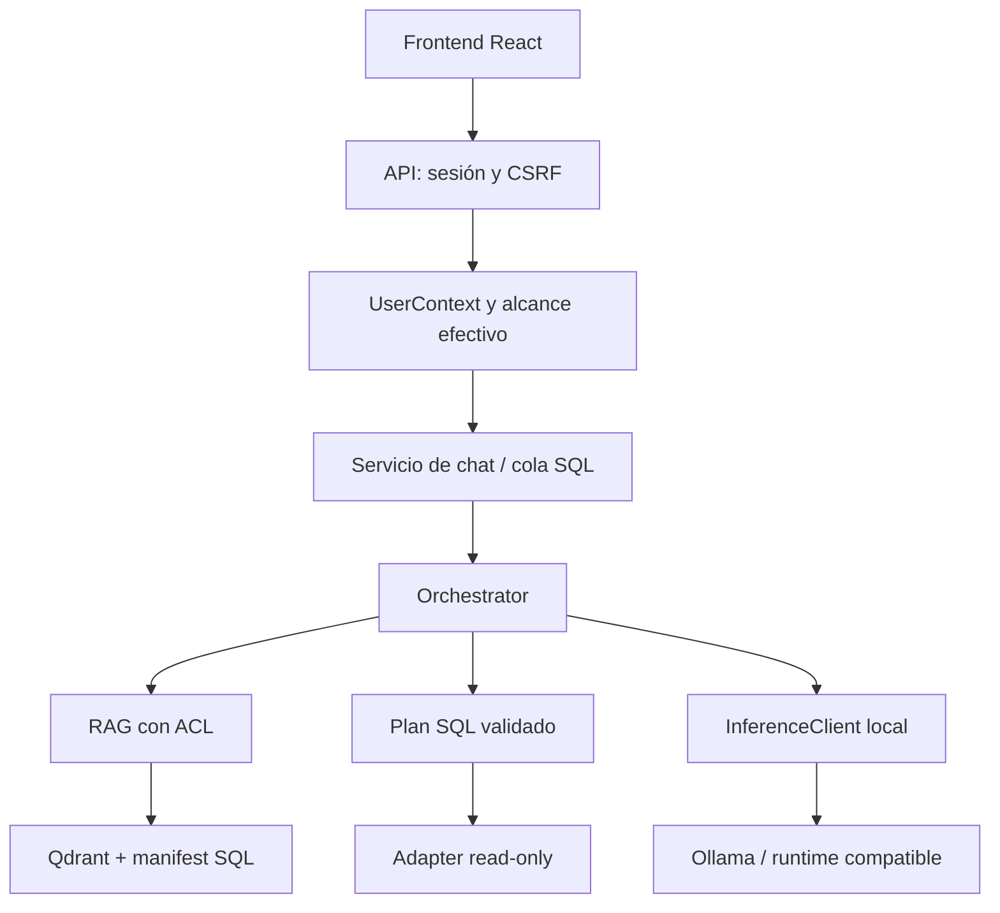

<!-- Creado por Aldo Garcia. -->

# Arquitectura, IA y datos

La estructura de referencia histórica es `Skayray360/matrix_v2`, commit
`9e375a4602191abc6546cfb757e5757443d43862`; no se presenta como el estado actual
del repositorio remoto.
El proyecto conserva sus carpetas, módulos, contratos HTTP y puertos de integración.
Integra el frontend del ZIP y las correcciones en las capas existentes. No requiere
aplicar ZIP de parches sobre esta entrega.

La entrega 1.3.1 integra la corrección RAG-01 y documentación consolidada.
Resultados de esta revisión: [VALIDACION_1.3.1.md](../reports/VALIDACION_1.3.1.md).

## Objetivo e invariantes

Asistir a RH mediante evidencia autorizada, consultas controladas y orientación
general identificada. Se conservan Windows/WAMP, React/FastAPI, interfaz, contratos
HTTP, historial/adjuntos privados y operación local del perfil entregado.

| Invariante | Regla |
| --- | --- |
| Localidad | Ollama, embeddings y almacenamiento locales; no activar cloud silenciosamente |
| Autorización | Roles/categorías y propietario antes de recuperar y al publicar |
| Evidencia | Conocimiento general y memoria no completan datos privados ausentes |
| Compatibilidad | Conservar rutas, contratos y archivos de negocio; migraciones incrementales |
| UX | Mantener marca, temas, fuentes y flujos existentes |
| Operación | Un proceso API; no presentar mocks o readiness como aceptación real |

No son capacidades implementadas: OCR, DOC legacy/PPTX, búsqueda BM25, reranker
entrenado, fine-tuning ni herramientas que escriban en sistemas corporativos externos.

## Correspondencia con la estructura original

| Ruta del repositorio y de esta entrega | Responsabilidad |
| --- | --- |
| `backend/app/` | Aplicación FastAPI y módulos de negocio |
| `backend/migrations/` | DDL incremental de MySQL/MariaDB con checksum |
| `backend/seeds/` | Datos sintéticos y materialización inicial de políticas |
| `backend/scripts/` | Bootstrap, preflight, evaluación, diagnóstico y release |
| `backend/tests/` | Pruebas unitarias, integración, seguridad y golden set |
| `frontend/src/` | Interfaz React/TypeScript y cliente de la API |
| `frontend/tests/` | Componentes, contratos y recorridos E2E |
| `config/authorization/` | Taxonomía documental y mapeos de roles |
| `config/data_sources/` | Catálogo de fuentes; contiene referencias a secretos |
| `data/knowledge/` | Corpus oficial: `general/` y `especializadas/<dominio>/` |
| `data/synthetic_test_data/` | Datos de prueba, separados del corpus real |
| `docs/` y `docs/integrations/` | Guías técnicas y de activación vigentes |
| `infrastructure/database/` | Aprovisionamiento de base y permisos |
| `infrastructure/nginx/` | Ejemplo de proxy HTTPS |
| `infrastructure/qdrant/` | Configuración de Qdrant dedicado |
| `scripts/` | Utilidades de mantenimiento del proyecto |
| `windows/` | Instalación, arranque, parada, diagnóstico y validación |
| `reports/` | Evidencia de la entrega y de ejecuciones identificadas |

Las adiciones operativas al checkout fuente son `frontend/dist/` (build incluido)
y `var/` (estado local). El instalador crea `.venv/` en la raíz; ni ese entorno
ni `node_modules/` forman parte del código distribuido. Los ejecutables y pesos
no se trasladan desde la máquina que preparó el ZIP.

## Capas del backend

| Capa | Módulos y contrato |
| --- | --- |
| Composición | `app/main.py`: middleware, routers, lifespan y frontend same-origin |
| HTTP | `app/api/`: dependencias de sesión/CSRF, schemas y rutas `/api/v1` |
| Identidad | `app/auth/`: puerto `IdentityProvider`, local de pruebas, OIDC interno y Entra |
| Autorización | `app/authorization/`: categorías, política y `UserContext` firmado e inmutable |
| Aplicación de chat | `app/agents/chat_service.py`: ejecución/publicación compartida y resultado independiente de HTTP |
| Cola de chat | `app/agents/chat_queue.py`: admisión, estado durable, dispatcher y reautorización |
| Agentes | `app/agents/orchestrator.py`, `knowledge_agent.py`, `query_planner.py`: intención y herramientas |
| RAG | `app/rag/`: fragmentación, recuperación ACL, generaciones y grounding |
| SQL controlado | `app/structured_data/`: plan JSON, alcance de entidades/filas, compilador y adapter read-only |
| Modelos | `app/llm/`: puerto `InferenceClient`, protocolos y política rápido/profundo |
| Memoria | `app/memory/`: conversaciones e historial filtrado por alcance vigente |
| Ingesta | `app/ingestion/`: loaders, extracción acotada, indexado y reconciliación |
| Jobs | `app/jobs/`: scheduler de reconciliación con lock en SQL |
| Persistencia | `app/database/`: engine, sesiones, ORM y migraciones |
| Controles transversales | `app/security/`, `app/audit/`, `app/common/`, `app/config/` |

Las dependencias van de HTTP hacia agentes y herramientas. La cola y el servicio
compartido no importan routers ni schemas HTTP. `chat_service.py` devuelve un DTO
propio; la ruta lo convierte al schema público. `common/` y `config/` no conocen
la API. El agente de conocimiento recibe `Evidence` autorizada, sin motor de
políticas ni acceso directo a Qdrant. Los adapters encapsulan HTTP de inferencia,
identidad externa y ejecución SQL.

## Flujo de una consulta

1. La API resuelve la sesión de servidor, comprueba CSRF en mutaciones y construye
   `UserContext` desde SQL. El navegador no entrega permisos confiables.
2. La ruta compatible `POST /api/v1/chat` ejecuta con cupos; la interfaz puede usar
   `POST /api/v1/chat/submit`, recibir 202 y consultar
   `GET /api/v1/chat/requests/{client_request_id}`. La clave está ligada al usuario
   y al hash del contenido; cancelación y expiración impiden publicación tardía.
3. La cola persiste estado y payload temporal en `chat_operations`, toma un lease
   en `job_locks` y revalida sesión/alcance al ejecutar. La migración `0007` añade
   las columnas de la cola; no modifica las migraciones anteriores.
4. El orquestador distingue identidad, general, conversación, documento, resumen,
   datos estructurados y consulta mixta. Identidad no necesita LLM ni RAG.
5. RAG aplica categorías corporativas o propietario/conversación dentro de Qdrant,
   además de la generación activa y la huella del índice. Recupera con coseno,
   deduplica, aplica MMR y diversidad antes de entregar evidencia.
6. La ruta estructurada acepta un plan JSON cerrado. Verifica permiso, fuente,
   entidad, columnas y filtros de filas del rol; el compilador produce parámetros
   y valida el AST antes del adapter read-only.
7. El agente de conocimiento construye el prompt con evidencia autorizada. Memoria
   y fuentes conservan el alcance de producción. El servicio reautoriza después
   de inferencia y antes del commit/publicación.

## Inferencia y operación local

Los defaults son Ollama en `127.0.0.1:11434`, `gemma4:latest` y
`embeddinggemma:latest` (768 dimensiones). Son nombres configurables en `.env`;
el preflight comprueba los modelos y la dimensión real, no los instala.
`LLM_LOCAL_ONLY=true` bloquea Vertex y exige hosts permitidos para inferencia.
Un runtime compatible con la API de chat/embeddings puede sustituir a Ollama.

Los perfiles FAST y DEEP usan el mismo Gemma con presupuestos distintos.
El perfil profundo permite análisis y resúmenes sin cambiar de pesos.
La selección, límites efectivos y protocolo de medición se documentan una sola vez
en [MODELOS_Y_RENDIMIENTO.md](MODELOS_Y_RENDIMIENTO.md).
`cited` acepta síntesis con referencias autorizadas y cifras
contrastadas, sin certificar veracidad semántica. `extractive` conserva el
contrato literal. La orientación general se identifica separadamente y no
confirma hechos internos, montos personales ni políticas de la empresa.

Producción local usa `AUTH_PROVIDER=oidc` con IdP interno HTTPS federado a AD.
Matrix no implementa bind LDAP/LDAPS directo. Entra y Vertex siguen como opciones
explícitas con dependencia cloud. `local_test` se limita a desarrollo/pruebas y
no sirve como autenticación productiva.

Hay un proceso API: los cupos de chat/inferencia/upload y la cola no constituyen
un scheduler distribuido. Qdrant embedded tampoco permite compartir el índice
con otro proceso. Qdrant server no elimina estas restricciones de la aplicación.

## Ingesta, jobs y estado

El scheduler reconcilia por defecto cada 24 horas. La ejecución manual y el hilo
comparten lock SQL. Los loaders actuales aceptan DOCX, MD, PDF textual, TXT, XLSX
y CSV; la extracción utiliza subproceso y límites de recursos. No hay OCR,
PowerPoint ni DOC legacy implementados.

La revisión del pipeline es `7` en `app/rag/index_manifest.py`. Una generación
nueva se escribe en Qdrant y sólo se hace visible al confirmar su manifest SQL.
El rollback mantiene la generación anterior; no existe transacción ACID común
entre ambos almacenes. El borrado lógico retira visibilidad y deja una bandera
para limpieza física posterior. Reindexar al cambiar pipeline, plantilla,
revisión/digest o modelo; cambiar dimensión exige colecciones compatibles.

| Estado | Propiedad y tratamiento |
| --- | --- |
| `.env` | Configuración privada; se conserva al instalar |
| MySQL/MariaDB | Sesiones, roles, conversaciones, operaciones, manifest, jobs y auditoría |
| `data/knowledge/` | Documentos oficiales clasificados y su control de publicación |
| `data/<alias>/` | Carpetas declaradas en `config/knowledge-layout.yaml`; su clasificación no concede permisos |
| `var/uploads/` | Adjuntos por propietario/conversación; SHA y rutas acotadas |
| `var/qdrant/` | Índice embedded; respaldo únicamente con el proceso detenido |
| `var/logs/` | Diagnóstico redactado, con correlación por request/operación |
| `frontend/dist/` | Salida de compilación; se sirve en el mismo origen que la API |

Respaldar estos estados como conjunto antes de una actualización. Restaurar sólo
Qdrant no reconstruye permisos, sesiones, propietarios ni manifest SQL.

## Intenciones y procedencia de la respuesta

| Intención | Ejecución |
| --- | --- |
| Identidad | Respuesta literal `Soy Matrix RH.`, sin modelo ni RAG |
| General | Prompt general separado; no confirma datos internos |
| Conversacional | Continuidad de diálogo dentro de memoria autorizada |
| Documental | Evidencia corporativa/privada, síntesis y comprobación de citas |
| Resumen documental | Evidencia autorizada y resumen acotado/jerárquico |
| Estructurada | Plan JSON → autorización → SQL parametrizado de sólo lectura |
| Mixta | Evidencia documental y estructurada con el mismo alcance efectivo |

El router es determinista, no un clasificador semántico entrenado. Evaluar siglas,
paráfrasis y seguimientos con el corpus real. `knowledge_agent.py` sólo recibe
`Evidence` autorizada: no controla políticas ni acceso directo a Qdrant.
Los prompts separan instrucciones, pregunta, memoria y contenido documental no confiable.

Con `ANSWER_ALLOW_GENERAL_KNOWLEDGE=true`, el modelo puede orientar sin documentos
en consultas abiertas. No debe completar una política interna, salario o beneficio
personal ausente. La respuesta puede separar «Información documentada» y «Orientación
general». `answer_basis` (`documented`, `general`, `mixed`, `insufficient`) expresa
procedencia y persiste en el historial; no garantiza exactitud factual.

## Persistencia y migraciones

El ORM de [models.py](../backend/app/database/models.py) y el DDL de
[migrations/](../backend/migrations/) definen el esquema. MySQL `DATETIME` se
interpreta consistentemente como UTC sin zona dentro del backend.

| Dominio | Tablas principales / responsabilidad |
| --- | --- |
| Identidad y sesión | `users`, `local_credentials`, `identity_links`, `sessions`, `oidc_login_states` |
| Roles y alcance | `roles`, `permissions`, `user_roles`, `role_permissions`, `category_permissions`, `structured_source_permissions` |
| Conversaciones | `conversations`, `conversation_messages`, `conversation_summaries` |
| Cola | `chat_operations`, con estado/idempotencia y payload temporal |
| Documentos | `documents`, `document_versions`, `document_access_policies`, manifest y generaciones |
| Conectores | `structured_data_sources`, `structured_source_policies`, referencias a secretos |
| Operación | `ingestion_jobs`, `job_locks`, `audit_events`, `schema_migrations` |

La tabla `authorization_policies` y el evaluador ABAC existen, pero no están
conectados al tráfico actual. Sus filas no sustituyen RBAC, categorías, ownership
ni restricciones de entidades/filas. Ver [permisos](AUTHENTICATION_AUTHORIZATION.md).

| Migración | Cambio |
| --- | --- |
| `0001` | Esquema inicial |
| `0002` | Campos de estado de auditoría/jobs |
| `0003` | Secuencia estable de mensajes |
| `0004` | Huella de autorización en memoria |
| `0005` | Generaciones del índice |
| `0006` | Operaciones identificables e idempotentes |
| `0007` | Payload y estado de cola |
| `0008` | Baja/purga de contenido; no ejecuta la purga al migrar |
| `0009` | Procedencia de respuesta |

El migrador propio registra checksum y rechaza una migración aplicada que cambió.
No editar DDL anterior, borrar registros de migración ni agregar columnas a mano.
`assert_database_is_ours` impide adoptar bases con tablas ajenas. La correspondencia
ORM/DDL se acepta con MySQL/MariaDB real, no con SQLite.

`deleted_at` retira visibilidad; `purged_at` confirma limpieza. El sistema conserva
metadata mínima sin contenido para impedir replay y publicación tardía. SQL y
Qdrant no comparten una transacción ACID: backup/restore debe abarcar ambos y los
archivos originales. Detalles de mantenimiento: [RUNBOOK.md](RUNBOOK.md).

## Límites de la validación

`/health` acredita proceso vivo; `/ready` comprueba dependencias. Una prueba con
transportes simulados, SQLite o Qdrant en memoria no valida WAMP ni los pesos en
Windows. La prueba real de instalación, login SSO, modelos, corpus y capacidad
se documenta por separado en los informes. `grounded=true` verifica controles
de evidencia, no garantiza veracidad o vigencia de los documentos.

Se conservan guardia de entrega, filtros firmados, ACL vigente, borrado coordinado
y procedencia. [Correcciones y evidencia](../reports/VALIDACION_1.3.1.md).

## Compatibilidad del índice

El extractor usa revisión 4 y `PIPELINE_VERSION` 7, heredados de 1.3.0. Se aplican las
validaciones de tamaño/tipo/compresión antes de extraer documentos de carpetas y
se limitan filas físicas y columnas XLSX en el lector. La huella distingue
revisiones de extracción anteriores. Si se reutiliza un índice incompatible,
reconciliar/reingerir antes de esperar evidencia. El ZIP revisado conserva los
documentos recibidos, pero no incluye índices de uso ni estado SQL. La actualización
conserva el estado ya instalado; los ejemplos ficticios quedan fuera de la ingesta.

Las citas corporativas conservan la ruta relativa; los adjuntos privados incorporan
el ID de documento para distinguir nombres iguales. Se conserva la autorización
por categoría/propietario/conversación, incluyendo la revalidación al publicar.
